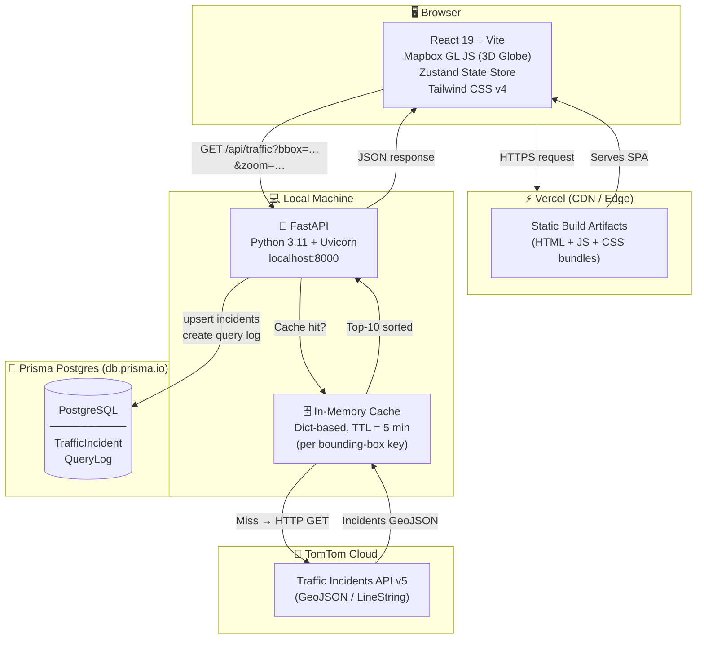
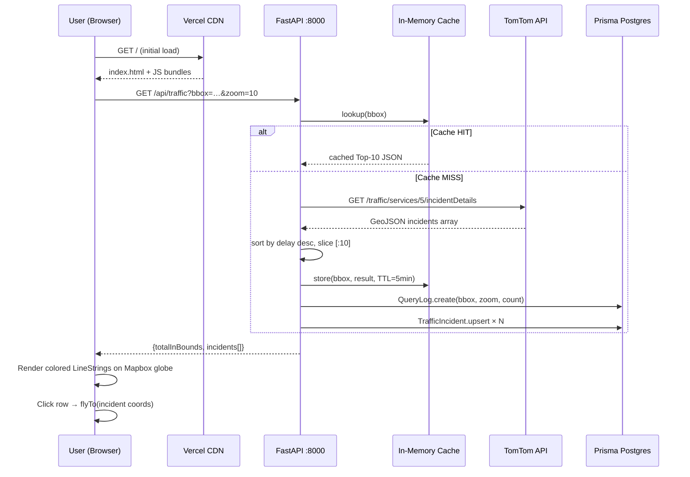

# Traffic Pulse — Architecture

## System Overview



---

## Data Flow Detail



---

## Component Map

```mermaid
graph LR
    subgraph Frontend["Frontend (React)"]
        APP[App.tsx]
        GLOBE[GlobeMap.tsx\nMapbox GL JS]
        LIST[TrafficList.tsx\nTop-10 sidebar]
        STORE[useTrafficStore.ts\nZustand]
    end

    subgraph API["API (FastAPI)"]
        MAIN[main.py]
        PROXY[/api/traffic endpoint]
        HEALTH[/health endpoint]
    end

    subgraph DB["Database (Prisma)"]
        SCHEMA[schema.prisma]
        TI[TrafficIncident model]
        QL[QueryLog model]
    end

    APP --> GLOBE
    APP --> LIST
    GLOBE --> STORE
    LIST --> STORE
    STORE --> PROXY
    PROXY --> MAIN
    MAIN --> TI
    MAIN --> QL
    TI --> SCHEMA
    QL --> SCHEMA
```

---

## Directory Structure

```
traffic-pulse/
├── ARCHITECTURE.md          ← this file
├── README.md
├── guidelines.md
├── fix_encoding.js
│
├── api/                     ← FastAPI backend (run locally)
│   ├── main.py              ← FastAPI app, TomTom proxy, cache logic
│   ├── schema.prisma        ← Prisma ORM schema (PostgreSQL)
│   ├── requirements.txt     ← Python dependencies
│   ├── .env                 ← secrets (gitignored)
│   └── .env.example
│
├── frontend/                ← React/Vite SPA → deployed to Vercel
│   ├── vercel.json
│   ├── vite.config.ts
│   ├── src/
│   │   ├── App.tsx
│   │   ├── components/
│   │   │   ├── GlobeMap.tsx
│   │   │   └── TrafficList.tsx
│   │   └── store/
│   │       └── useTrafficStore.ts
│   └── ...
│
└── backend/                 ← Legacy Node.js/Express (reference only)
    └── server.ts
```

---

## Environment Variables

| Variable | Where | Description |
|---|---|---|
| `VITE_MAPBOX_TOKEN` | Vercel + frontend/.env | Mapbox public access token |
| `VITE_API_URL` | Vercel + frontend/.env | FastAPI base URL (default: http://localhost:8000) |
| `TOMTOM_API_KEY` | api/.env | TomTom Traffic API key |
| `DATABASE_URL` | api/.env | Prisma Postgres connection string |
